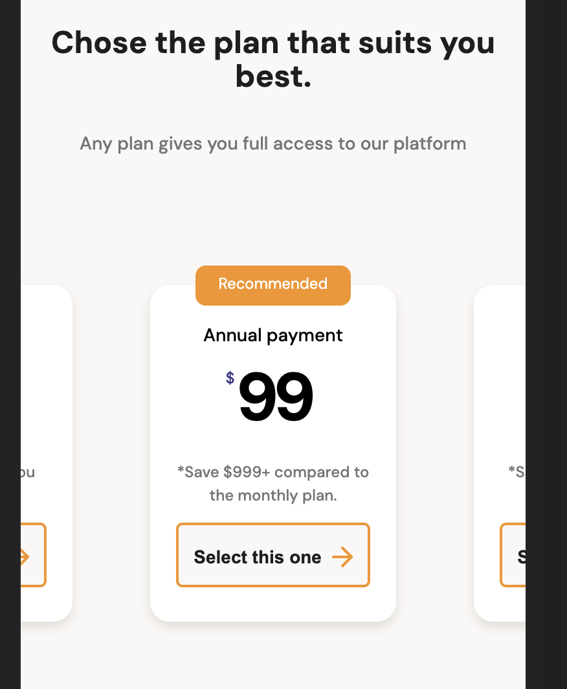

# Batatabit Website - Mobile-First Responsive Design

# Images

### Movil

### Desktop 

Batatabit is a responsive website that provides real-time information about cryptocurrencies. The website is designed a Mobile-First approach, ensuring it looks and functions seamlessly on various devices, including smartphones, tablets, and desktops.

## Table of Contents 

- Overview
- Technologies Used
- Installation
- Contributing
- License

## Overview

Batatabit is a user-friendly platform that allows users to navigate between different cryptocurrency prices and trends. The website's main features include: 

- ### Mobile-First Responsive Design: 
  The website adapts to different screen sizes, providing an optimal user experience on mobile devices.
- ### Real-Time Exchange Rates: 
  Batatabit offers real-time information on the most important exchange offices and currencies worldwide.
- ### Transparent Pricing: 
  Users can view the real cost of acquiring cryptocurrencies without any hidden fees.
- ### Product Detail: 
  The website showcases a product without comparison, designed for reliability and everyday use.
- ### Cryptocurrency Table: 
  The website displays current rates for various cryptocurrencies, along with indicators for price changes.
- ### Plans and Pricing: 
  Users can choose from different subscription plans, each providing full access to the platform.

## Technologies Used

The Batatabit website is built using the following technologies:

- HTML
- CSS with a mobile-first approach
- JavaScript (not shown in the provided code snippet)

The website also utilizes various assets, including images and icons.

## Installation

To run the Batatabit website locally, follow these steps:

1. Clone the repository:

### git clone https://github.com/your-username/batatabit-website.git

2. Open the project folder:

### cd batatabit-website

3. Open the *index.html* file in your web browser.

## Contributing

Contributions to the Batatabit website are welcome! If you have any suggestions, bug reports, or feature requests, please feel free to submit an issue or a pull request to the repository.

## License

The Batatabit website is open-source and licensed under the MIT License. You are free to modify and use the code as per the terms of the license.
